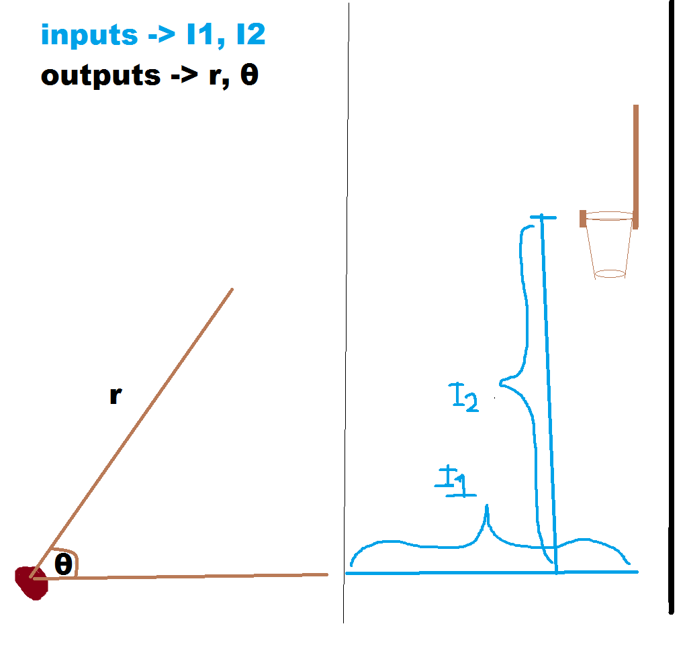

# Free Thrower
 Training a neural network to shoot basketball free throws consistantly. 

## Initial plan:

# Results
We can see that the "Shooters" learn to shoot the basketballs to the right, but not too strong to overshoot the hoop.
